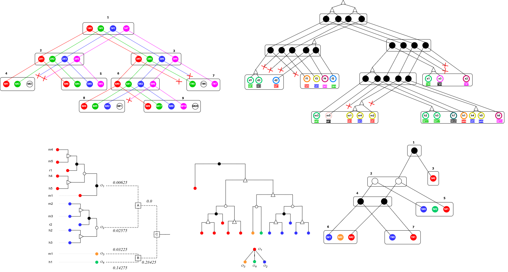

<h1 align="center"> :palm_tree: Inferring Transcript Phylogenies from Transcript Ortholog Clusters :palm_tree: </h1>

 

:busts_in_silhouette: __Authors__
* __Wend Yam D D Ouedraogo & Aida Ouangraoua__, CoBIUS LAB, Department of Computer Science, Faculty of Science, Université de Sherbrooke, Sherbrooke, Canada*

> :bulb: If you are using our algorithm in your research, please cite our recent paper: __Upcoming__ 

> :e-mail: __Contact: wend.yam.donald.davy.ouedraogo@usherbrooke.ca__
<!-- TABLE OF CONTENTS -->
<h2 id="table-of-contents"> :book: Table of Contents</h2>

1. [➤ About the project](#about-the-project)
    1. [➤ Overview](#overview)
    2. [➤ Operating System](#os)
    3. [➤ Requirements](#requirements)
2. [➤ Inferring Transcript Phylogenies from Transcript Ortholog Clusters](#clustering)
    1. [➤ Package Pypi](#package)
    2. [➤ Getting Started](#getting-started)
    3. [➤ Project files descriptions](#project-files-description)
        1. [➤ Inputs description](#project-files-description-inputs)
        2. [➤ Outputs description](#project-files-description-outputs)

