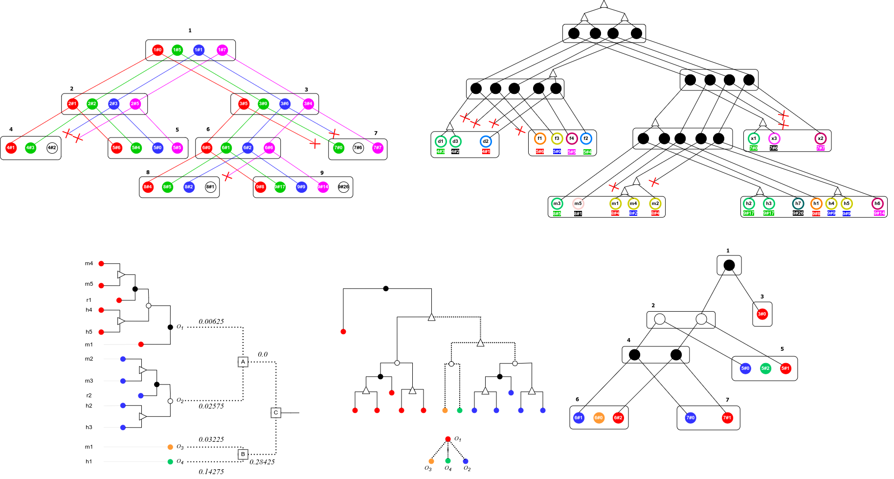
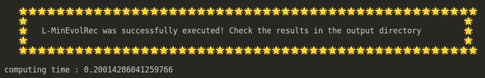
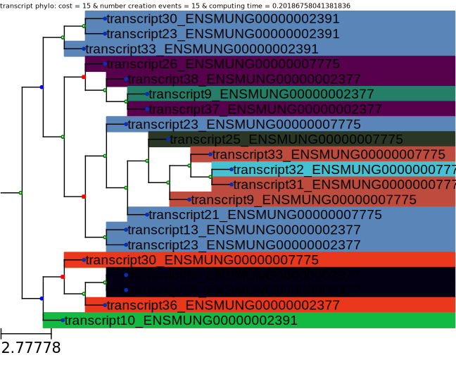

<h1 align="center"> :palm_tree: Inferring Transcript Phylogenies from Transcript Ortholog Clusters :palm_tree: </h1>

 

:busts_in_silhouette: __Authors__
* __Wend Yam D D Ouedraogo & Aida Ouangraoua__, CoBIUS lab, Department of Computer Science, Faculty of Science, Université de Sherbrooke, Sherbrooke, Canada*

> :bulb: If you are using our algorithm in your research, please cite our recent paper: __Upcoming__ 

> :e-mail: __Contact: wend.yam.donald.davy.ouedraogo@usherbrooke.ca__
<!-- TABLE OF CONTENTS -->
<h2 id="table-of-contents"> :book: Table of Contents</h2>

1. [➤ About the project](#about-the-project)
    1. [➤ Overview](#overview)
    2. [➤ Operating System](#os)
    3. [➤ Requirements](#requirements)
2. [➤ Inferring Transcript Phylogenies from Transcript Ortholog Clusters](#clustering)
    1. [➤ Package Pypi](#package)
    2. [➤ Getting Started](#getting-started)
    3. [➤ Project files descriptions](#project-files-description)
        1. [➤ Inputs description](#project-files-description-inputs)
        2. [➤ Outputs description](#project-files-description-outputs)

<!-- ABOUT THE PROJECT -->
<h1 name="about-the-project"> :pencil: About The Project</h1>

<!-- OVERVIEW -->
<h3 name="overview"> :cloud: Overview</h3>

`A progressive supertree construction algorithm that relies on a dynamic programming approach to infer a transcript phylogeny based on precomputed clusters of orthologous transcripts.`

<!-- OPERATING SYSTEM -->
<h3 name="os"> :man_technologist: Operating System</h3>
The program was both developed and tested on a system operating Ubuntu version 22.04.6 LTS and Windows 11 OS.

<!-- Requirements -->
<h3 name="requirements"> :hammer_and_pick: Requirements</h3>

*   __`python3 (at leat python 3.6)`__
*   __`Pandas`__
*   __`Numpy`__
*   __`ETE toolkit (ete3)`__
*   __`PyQt5`__
*   __`PhyloTreeLib`__

<!-- ABOUT THE PROJECT -->
<h2 name="clustering"> Inferring transscript phylogenies from transcript ortholog clusters</h2>

<!-- Package -->
<h3 name="package"> :package: About the package</h3>

> ***upcoming***

<!-- Getting started -->
<h2 id="getting-started"> :rocket: Getting Started</h2>

> ***Command***

<pre><code>usage: minevolrec.py [-h] -l LABEL -clus CLUSTERS -nhx NHX -map MAPPINGS -matx MATRIX [-forest FOREST] [-forest_threshold FOREST_THRESHOLD]
                     [-join JOIN] [-outf OUTPUT] [-outp PREFIX] [-c COMPUTE]

parsor program parameter

options:
  -h, --help            show this help message and exit
  -l LABEL, --label LABEL
                        0 | 1, Boolean variable controlling the utilization of the labeled version of the algorithm (0) or the non-labeled
                        version (1).
  -clus CLUSTERS, --clusters CLUSTERS
                        FASTA file containing cluster IDs in front of each id_transcript separated by semicolons
  -nhx NHX, --nhx NHX   txt file containg gene tree format => NHX format
  -map MAPPINGS, --mappings MAPPINGS
                        FASTA file containg transcripts and their corresponding genes separated by semicolons.
  -matx MATRIX, --matrix MATRIX
                        CSV file containing matrix separated by comma ';'(header: True, index: True)Note: Index must correspond to the
                        header.
  -forest FOREST, --forest FOREST
                        0 | 1, boolean variable controls the reconstruction of a rooted binary transcript tree(1) or transcript forest(0).
  -forest_threshold FOREST_THRESHOLD, --forest_threshold FOREST_THRESHOLD
                        float variable represents threshold to cut the dendogram(minimum evolution tree)
  -join JOIN, --join JOIN
                        min(1) | mean(0) | max(2). By default(1)
  -outf OUTPUT, --output OUTPUT
                        output folder
  -outp PREFIX, --prefix PREFIX
                        prefix of output files
  -c COMPUTE, --compute COMPUTE
                        0 | 1, Compute all solutions(By default False(1))</code></pre>

> Usage example

<pre><code>python3 scripts/minevolrec.py -l 0 -map example/mappings.maps -clus example/clusters.clus -nhx example/tree.nhx -matx example/matrix.matx </code></pre>
OR
<pre><code>sh ./minevolrec.sh</code></pre>

> Output expected

 

<h2 name="project-files-description"> :file_folder: Project Files Description</h2>

<h3 name="project-files-description-inputs"> :keyboard: Inputs description </h3>

__Inputs files [mandatory parameters]__

> `mappings.maps [-map mappings.maps]`

A file that lists each transcript (t) in the observation along with its corresponding gene (g). The row format is as follows:
**>t:g**

> `clusters.clus [-clus clusters.clus]`

A file that lists each transcript (t) in the observation along with the cluster id (IDcluster) where it is included. The row format is as folows: **>t:IDcluster**

> `matrix.matx [-matx matrix.matx]`

A *CSV* file that describes the pairwise similarity score for a set of observed transcripts.  The file must contains a header and records separated by the character *';'*. The header should be as follows : **['transcripts', [record]]**. An example is given in the folder 'example/input/'.

:bangbang: The transcript similarity used for the pre-computation of the matrix file is described in <a href="https://github.com/UdeS-CoBIUS/TranscriptOrthology">another repository</a> [<a href="https://link.springer.com/chapter/10.1007/978-3-031-36911-7_2">:book: read the paper</a>]

> `tree.nhx [-nhx tree.nhx]`

A *NHX* tree describing the evolution of the studied gene family.

--- 

<h3 name="project-files-description-outputs"> :minidisc: Outputs description </h3>

__Outputs folders/files__

> dendogram 

    The folder contains the guide tree in NEWICK.

> ortholog_trees

    The folder contains each ortholog trees.

> solution.nhx

    The file contain the reconstructed transcript phylogeny In NHX format 

> solution.svg

    The file yield a visualization of the transcript tree, as follows for instance:

 
 

    green node: creation, red node: gene duplication, blue node: apeciation. The transcripts in the same ortholog trees are displayed with a distinct color at the leaves. The LCA-reconciliation cost is given at the top of the figure.
